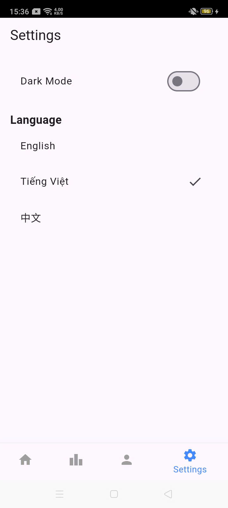
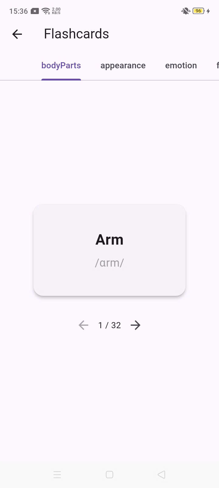
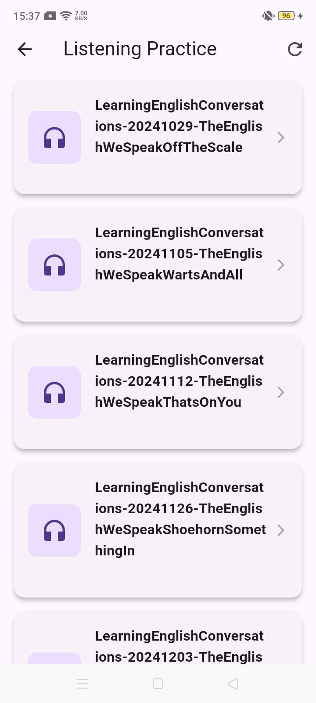
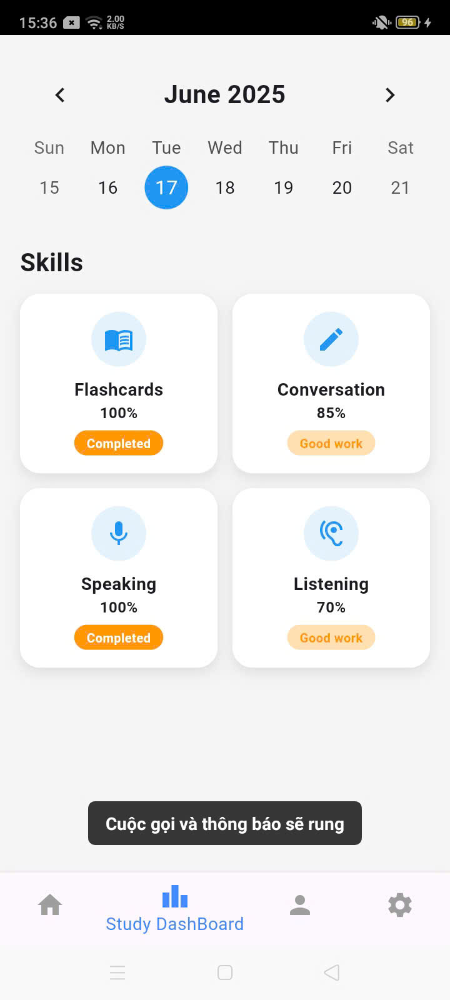

# English Learning App

---

## 🚀 Giới thiệu

**English Learning App** là ứng dụng học tiếng Anh toàn diện được xây dựng bằng Flutter, hỗ trợ đa nền tảng (Android, iOS, Web, Desktop). Ứng dụng tích hợp AI và các tính năng hiện đại giúp người học nâng cao kỹ năng tiếng Anh một cách hiệu quả.

---

## 🗂️ Cấu trúc dự án

```
english-learning-app/
├── README.md
├── SECURITY.md
├── images/                          # Screenshots của ứng dụng
│   ├── z6714363412575_f93b25a8cd84a11a2d722e9d40de7a23.jpg
│   ├── z6714363415070_34390d8052f35acf86d416e1b8b47c71.jpg
│   └── ...
└── flutter_app/                     # Main Flutter project
    ├── lib/
    │   ├── main.dart                # Entry point
    │   ├── components/              # UI components
    │   │   ├── home_content.dart
    │   │   ├── FlashcardWidget.dart
    │   │   ├── custom_calendar.dart
    │   │   └── ...
    │   ├── pages/                   # App screens
    │   │   ├── login_screen.dart
    │   │   ├── home_screen.dart
    │   │   ├── vocab_screen.dart
    │   │   ├── speaking_detail_page.dart
    │   │   └── ...
    │   ├── services/                # Business logic
    │   │   ├── speech_recognition_service.dart
    │   │   ├── dictionary_service.dart
    │   │   ├── huggingface_service.dart
    │   │   └── ...
    │   ├── models/                  # Data models
    │   ├── providers/               # State management
    │   └── ...
    ├── assets/                      # App resources
    │   ├── audio/                   # Listening materials
    │   ├── images/
    │   ├── grammar.json
    │   ├── flashcard.json
    │   └── ...
    ├── android/                     # Android platform
    ├── ios/                         # iOS platform
    ├── web/                         # Web platform
    ├── windows/                     # Windows platform
    ├── linux/                       # Linux platform
    ├── macos/                       # macOS platform
    └── pubspec.yaml                 # Dependencies
```

---

## 🌟 Tính năng nổi bật

### 🔐 Xác thực & Quản lý người dùng
- Đăng ký/Đăng nhập bằng Firebase Auth
- Xác minh email tự động
- Lưu trữ thông tin người dùng trên Firestore

### 📚 Học từ vựng thông minh
- Tra cứu từ điển trực tuyến (Dictionary API)
- Phát âm chuẩn với audio
- Định nghĩa chi tiết và ví dụ minh họa
- Giao diện thân thiện với debounce search

### 🗣️ Luyện phát âm AI
- Nhận diện giọng nói thời gian thực
- So sánh phát âm với mẫu chuẩn
- Feedback chi tiết về độ chính xác
- Hỗ trợ nhiều chế độ luyện tập

### 🎧 Luyện nghe tương tác
- Thư viện âm thanh đa dạng
- Điều khiển tốc độ phát
- Transcript đồng bộ
- Chế độ lặp lại thông minh

### 📝 Ngữ pháp có hệ thống
- 12 thì trong tiếng Anh
- Cấu trúc - Cách dùng - Ví dụ
- Bài tập tương tác (trắc nghiệm, điền từ)
- Lưu tiến trình học tập

### 🃏 Flashcard thông minh
- Chia theo chủ đề
- Hiệu ứng lật thẻ 3D
- Theo dõi tiến độ từng thẻ
- Navigation linh hoạt

### 🤖 Hội thoại AI
- Tích hợp HuggingFace DialoGPT
- Chat tự nhiên bằng tiếng Anh
- Phản hồi thông minh
- Giao diện chat hiện đại

### 📊 Theo dõi tiến trình
- Dashboard học tập cá nhân
- Lịch học tương tác
- Bảng xếp hạng
- Thống kê chi tiết

### ⚙️ Cài đặt linh hoạt
- Dark/Light mode
- Đa ngôn ngữ (EN/VI/中文)
- Tùy chỉnh giao diện
- Sync trên cloud

---

## 🖼️ Demo giao diện

<div align="center">

### 📱 Màn hình chính
<table>
  <tr>
    <td align="center" width="250">
      
      <br/><sub><b>🏠 Trang chủ</b></sub>
    </td>
    <td align="center" width="250">
      
      <br/><sub><b>🃏 Flashcard</b></sub>
    </td>
  </tr>
</table>

### 🎯 Các tính năng học tập
<table>
  <tr>
    <td align="center" width="200">
      
      <br/><sub><b>📚 Tra từ vựng</b></sub>
    </td>
    <td align="center" width="200">
      
      <br/><sub><b>🎧 Luyện nghe</b></sub>
    </td>
    <td align="center" width="200">
      
      <br/><sub><b>🗣️ Luyện nói</b></sub>
    </td>
    <td align="center" width="200">
      
      <br/><sub><b>📝 Bài tập</b></sub>
    </td>
  </tr>
</table>

### 🤖 Tính năng AI & Tiện ích
<table>
  <tr>
    <td align="center" width="300">
      
      <br/><sub><b>🤖 Chat với AI</b></sub>
    </td>
    <td align="center" width="300">
      
      <br/><sub><b>⚙️ Cài đặt</b></sub>
    </td>
  </tr>
</table>

</div>

> _Giao diện hiện đại, responsive và hỗ trợ đa nền tảng_

---

## 🛠️ Công nghệ & Kiến trúc

### Frontend Framework
- **Flutter SDK 3.0+** - UI đa nền tảng
- **Dart** - Ngôn ngữ lập trình chính

### State Management
- **Provider** - Quản lý state toàn cục
- **ChangeNotifier** - Observer pattern

### Backend & Database
- **Firebase Auth** - Xác thực người dùng
- **Cloud Firestore** - NoSQL database
- **SQLite** - Lưu trữ offline (bài tập, cache)

### AI & APIs
- **HuggingFace DialoGPT** - AI chatbot
- **Dictionary API** - Tra cứu từ điển
- **Speech-to-Text** - Nhận diện giọng nói

### UI/UX Libraries
- **Google Fonts** - Typography
- **Percent Indicator** - Progress bars
- **Table Calendar** - Lịch tương tác
- **Audioplayers** - Phát âm thanh

### Platform Support
- **Android** (API 21+)
- **iOS** (iOS 11+)
- **Web** (Modern browsers)
- **Windows** (Win32)
- **Linux** (GTK)
- **macOS** (10.14+)

---

## 📋 Yêu cầu hệ thống

### Development Environment
- Flutter SDK 3.0+
- Dart SDK 2.17+
- Android Studio / VS Code
- Git

### Platform-specific
**Android:**
- Android SDK 21+
- Java 8+

**iOS:**
- Xcode 13+
- iOS 11+
- CocoaPods

**Desktop:**
- Windows: CMake, Visual Studio Build Tools
- Linux: CMake, GTK 3.0+
- macOS: Xcode Command Line Tools

### Services
- Firebase project (Free plan)
- HuggingFace API token (Free tier)

---

## 🚀 Cài đặt & Chạy ứng dụng

### 1. Clone repository
```bash
git clone https://github.com/your-username/english-learning-app.git
cd english-learning-app
```

### 2. Cấu hình Firebase
```bash
# Install Firebase CLI
npm install -g firebase-tools

# Login to Firebase
firebase login

# Configure FlutterFire
cd flutter_app
dart pub global activate flutterfire_cli
flutterfire configure
```

### 3. Cấu hình Environment Variables
```bash
# Tạo file .env trong flutter_app/
cd flutter_app
cp .env.example .env

# Chỉnh sửa .env
HUGGING_FACE_API_TOKEN=your_token_here
```

### 4. Cài đặt dependencies
```bash
cd flutter_app
flutter pub get
```

### 5. Chạy ứng dụng

**Mobile (Android/iOS):**
```bash
flutter run
```

**Web:**
```bash
flutter run -d chrome
```

**Desktop:**
```bash
# Windows
flutter config --enable-windows-desktop
flutter run -d windows

# Linux
flutter config --enable-linux-desktop
flutter run -d linux

# macOS
flutter config --enable-macos-desktop
flutter run -d macos
```

---

## 📱 Build & Deploy

### Android APK
```bash
flutter build apk --release
# Output: build/app/outputs/flutter-apk/app-release.apk
```

### iOS IPA
```bash
flutter build ios --release
# Sau đó sử dụng Xcode để archive
```

### Web
```bash
flutter build web --release
# Output: build/web/
```

### Desktop
```bash
# Windows
flutter build windows --release

# Linux
flutter build linux --release

# macOS
flutter build macos --release
```

---

## 🗃️ Cấu trúc dữ liệu

### Firebase Collections
```
users/
├── {userId}/
    ├── email: string
    ├── createdAt: timestamp
    └── profile: object

conversations/
├── {conversationId}/
    ├── userId: string
    ├── messages: array
    └── timestamp: timestamp
```

### SQLite Schema
```sql
CREATE TABLE questions (
  id INTEGER PRIMARY KEY AUTOINCREMENT,
  exerciseType TEXT,
  questionText TEXT,
  correctAnswer TEXT,
  type TEXT,
  options TEXT,
  correctOption TEXT
);
```

### Assets Structure
```
assets/
├── audio/
│   ├── listening1.mp3
│   ├── listening2.mp3
│   └── ...
├── images/
│   ├── lesson1.png
│   ├── user1.png
│   └── ...
├── grammar.json       # Ngữ pháp
├── flashcard.json     # Flashcards
├── questions.json     # Bài tập
└── sentences.json     # Câu hội thoại
```

---

## 🔧 Customization

### Thêm ngôn ngữ mới
1. Cập nhật [`SettingsProvider`](flutter_app/lib/providers/setting_provider.dart)
2. Thêm strings trong assets
3. Test UI với ngôn ngữ mới

### Thêm bài tập mới
1. Cập nhật [`questions.json`](flutter_app/assets/questions.json)
2. Chạy [`loadAndInsertQuestions()`](flutter_app/lib/services/data_loader.dart)
3. Test trong [`ExerciseScreen`](flutter_app/lib/pages/exercise_screen.dart)

### Tùy chỉnh AI Chat
1. Thay đổi model trong [`HuggingFaceService`](flutter_app/lib/services/huggingface_service.dart)
2. Cập nhật API endpoint
3. Test response parsing

---

## 🧪 Testing

### Unit Tests
```bash
cd flutter_app
flutter test
```

### Integration Tests
```bash
cd flutter_app
flutter test integration_test/
```

### Platform Tests
```bash
# Test trên nhiều device
flutter devices
flutter run -d {device_id}
```

---

## 🔒 Bảo mật

- Xem chi tiết trong [SECURITY.md](SECURITY.md)
- API keys được bảo vệ trong `.env`
- Firebase Security Rules được cấu hình
- Input validation ở mọi layer
- HTTPS enforced cho tất cả requests

---

## 🤝 Đóng góp

### Quy trình đóng góp
1. Fork repository
2. Tạo feature branch (`git checkout -b feature/AmazingFeature`)
3. Commit changes (`git commit -m 'Add AmazingFeature'`)
4. Push to branch (`git push origin feature/AmazingFeature`)
5. Tạo Pull Request

### Code Style
- Sử dụng `flutter format`
- Follow Dart conventions
- Comment cho complex logic
- Test coverage >80%

---

## 📊 Performance & Optimization

### App Performance
- Tree shaking enabled
- Image optimization
- Lazy loading cho lists
- Efficient state management

### Build Optimization
```bash
# Analyze bundle size
flutter build apk --analyze-size

# Profile performance
flutter run --profile
```

---

## 🐛 Troubleshooting

### Common Issues

**Firebase Connection:**
```bash
# Kiểm tra firebase config
firebase projects:list
flutterfire configure
```

**Platform Build Errors:**
```bash
# Clean build
flutter clean
flutter pub get
flutter build {platform}
```

**API Issues:**
- Kiểm tra API keys trong `.env`
- Verify network connectivity
- Check API rate limits

---

## 📞 Hỗ trợ & Liên hệ

- 🐛 **Bug Reports**: [GitHub Issues](https://github.com/YoloApple/english-learning-app/issues)
- 📧 **Email**: dungbui0403@gmail.com

---

## 📄 License

Dự án được phân phối dưới giấy phép MIT. Xem `LICENSE` để biết thêm chi tiết.

```
MIT License

Copyright (c) 2024 English Learning App Team

Permission is hereby granted, free of charge, to any person obtaining a copy
of this software and associated documentation files (the "Software"), to deal
in the Software without restriction...
```

---

## 🙏 Acknowledgments

- [Flutter Team](https://flutter.dev) - Amazing framework
- [Firebase](https://firebase.google.com) - Backend services
- [HuggingFace](https://huggingface.co) - AI models
- [Dictionary API](https://dictionaryapi.dev) - Free dictionary service
- [Material Design](https://material.io) - Design guidelines
- Open source community - Inspiration & libraries

---

## 📈 Roadmap

### Version 2.0 (Coming Soon)
- [ ] Offline mode hoàn chỉnh
- [ ] Multiplayer games
- [ ] Video lessons
- [ ] Advanced analytics
- [ ] Custom AI tutor

### Version 2.1
- [ ] Wear OS support
- [ ] Voice commands
- [ ] AR pronunciation guide
- [ ] Community features

---

> Made with ❤️ by YoloApple | Powered by Flutter & Firebase

---

**⭐ Nếu bạn thấy dự án hữu ích, hãy star repo này! ⭐**
